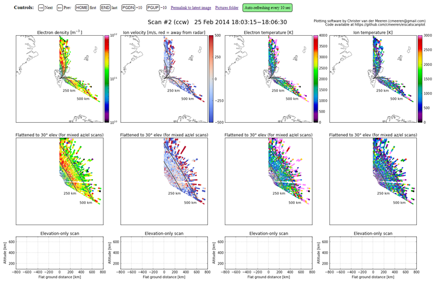

Description
-----------

This is a python script for very easy realtime and offline plotting of EISCAT scans of all types (azimuth, elevation/MSP, and mixed) – literally a one-line command in its simplest form. It also creates a website to allow for viewing the scans from outside the radar site (can be disabled). The script can be used on its own (useful for realtime plotting) or used as a standard Python module which allows you to easily overlay scans on top of arbitrary axes (see section below on advanced usage). The script is currently hard-coded to work for the EISCAT Svalbard Radar (ESR), let me know if you need it changed to work for another site (shouldn't take much work).

Scans are detected based on two criteria: 1) azimuthal changes, and if azimuth is stationary, 2) elevational changes (e.g. meridional scans). Nothing will be plotted in periods when the radar is completely stationary.

For example, say you are doing a "right-angled triangle" scan pattern which scans first in azimuth only, then in elevation only, and then mixed azimuth/elevation back to the starting point. All these movements will be plotted sensibly by this script as three separate scans.

An example plot is given below.

* **Top row:** Scan on map, with altitude lines indicating 250 and 500 km.
* **Middle row:** Same scan, but projected to 30 degrees elevation. Useful for mixed azimuth-elevation scans (such as this).
* **Bottom row:** Altitude vs. ground range, only elevation (0–180°) is taken into account. Useful for elevation-only scans.



Really simple usage
-------------------

Check the requirements at the bottom of this page to ensure you have what you need. Download or clone this repository, open a terminal, go to the folder and run the script using

    python eiscatscanplot.py

If you're not at the ESR, you'll have to enter a data path. If you're at the ESR, the script will auto-detect the latest 32m data folder (but lets you choose another folder if you wish). After this you will get a chance to change some settings (if you're lucky, the defaults work perfectly fine). The settings are described in full [on this page](https://github.com/cmeeren/eiscatscanplot/wiki).

That's it!

The script will update plots in realtime, and when it detects the end of a scan, it will save the figure and start a new plot.

More advanced usage
-------------------

You can use the script to parse scans without plotting (by passing `savePath=None` and `doPlot=False` as arguments to `scan_parse()`) and overlay them on arbitrary map axes (using `Scan.plot_overlay()`). Here is an example (the `eiscatsanplot` folder containing these scripts is assumed to be on your Python path):

```python
# change to a real data folder if you want to run this script
dataFolder = '/path/to/analysed/data'

import eiscatscanplot as esp
import matplotlib.pyplot as plt
from mpl_toolkits.basemap import Basemap

# parse all scans from this data folder - we'll get a list of scan objects.
# we can also add e.g. onlyDoScanNo=3 to only get scan #3 (not a list)
allScans = esp.eiscatscanplot.scan_parse(dataFolder, savePath=None, doPlot=False)

# initiate map
mapObj = Basemap(width=1.8e6,
                 height=1.8e6,
                 projection='aeqd',
                 lat_0=78.153,
                 lon_0=16.029,
                 resolution='l')

# initiate figure
fig = plt.figure()
ax = plt.gca()

# draw continents, coastlines, and grid
mapObj.fillcontinents(color='.8')
mapObj.drawcoastlines(linewidth=0.5, zorder=4)
mapObj.drawparallels(range(0, 90, 5), labels=[1, 0, 0, 0])
mapObj.drawmeridians(range(0, 360, 10), labels=[0, 0, 0, 1])

# plot scan #3. You can of course loop through
# allScans and plot every scan if you want.
scanObj = allScans[2]
patchCollection = scanObj.plot_overlay(mapObj, ax, data='Ne',
                                       altLines=[250, 500], cmap='jet',
                                       zorder=2, linewidth=0)

# add colorbar
plt.colorbar(mappable=patchCollection, label=u'Ne [$\mathregular{m^{−3}}$]')

# set title including scan direction, start and end
plt.title('ESR Ne {} {:%d %b %Y %H:%M:%S}-{:%H:%M:%S}'.format(scanObj.scDir,
                                                              scanObj.scanStart,
                                                              scanObj.scanEnd))

plt.show()
```

FAQs
----

* **Why are there sometimes white gaps in my scans?**  
If there is a gap of more than 2 seconds between the end of one data dump and the start of the next, that gap is treated as missing data, and the adjacent beams will not appear contiguous.
* **But there are huge gaps all over the place, looks like every other data dump is not used!**  
You might have done something wrong in GUISDAP. When analysing the data, try using `analysis_sweep = 'az';` (or `'el'` or `'azel'`) in the “Special” box. This will make GUISDAP ignore changes in azimuth/elevation when integrating, and might fix problems if you analyse with a different integration period than the raw data's integration period.

Requirements
------------

* Python 2.7
* numpy
* scipy
* matplotlib
* basemap (from mpl_toolkits)

On a normal Python 2.7 installation on, say, Ubuntu, these can be installed by running

    sudo apt-get install python-numpy python-scipy python-matplotlib python-mpltoolkits.basemap

Additionally, when doing offline plotting, you'll get a nice progress bar if you install `frogress` (optional).
